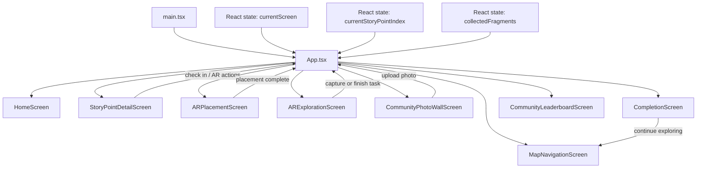

# System Architecture

## Current Prototype Architecture

The current system is a client-side React application built with Vite. It does not yet use a backend service or database. User interaction state is managed in the browser through React state and passed between screens as props.

## Data Flow Summary

1. `main.tsx` mounts the application.
2. `app/App.tsx` acts as the screen controller and central state container.
3. Screen components render the current journey stage and call handler functions passed from `App.tsx`.
4. User actions update local state such as current checkpoint, collected fragments, and completion status.
5. The updated state drives the completion screen, community wall flow, and leaderboard experience.

## Mermaid Diagram

## Backend Extension Plan

This structure is ready for future collaboration with backend teammates. The most natural next steps are:

- replace local fragment progress with API-backed user progress
- connect community uploads to cloud storage or a database
- replace static leaderboard content with dynamic ranking data
- persist checkpoint completion and guide interactions for repeat sessions
