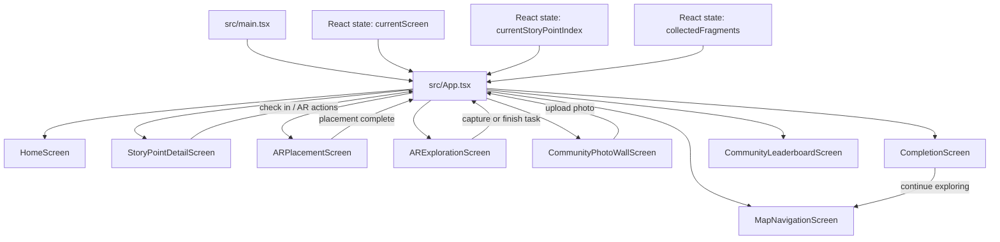

# System Architecture

## Current Prototype Architecture

The current system is a client-side React web application built with Vite and optimized for a mobile-first heritage exploration flow. It does not yet use a backend service or database. User interaction state is managed in the browser through React state and passed between screens as props, which provides clear evidence of how the prototype handles user input and interaction progress.

## Data Flow Summary

1. `src/main.tsx` mounts the application.
2. `src/App.tsx` acts as the screen controller and central state container.
3. Screen components under `src/components/` render the current journey stage and call handler functions passed from `App.tsx`.
4. User actions update local state such as current checkpoint, collected fragments, and completion status.
5. The updated state drives the completion screen, community wall flow, and leaderboard experience.

## Portfolio Alignment Notes

- The live system is a responsive web app that can be hosted on Vercel or GitHub Pages.
- The architecture supports the three showcased must-have playful features: story exploration, AR-style guide interaction, and community participation.
- The current implementation demonstrates interaction-state management without requiring a backend database at the prototype stage.

## Mermaid Diagram

## Backend Extension Plan

This structure is ready for future collaboration with backend teammates. The most natural next steps are:

- replace local fragment progress with API-backed user progress
- connect community uploads to cloud storage or a database
- replace static leaderboard content with dynamic ranking data
- persist checkpoint completion and guide interactions for repeat sessions
