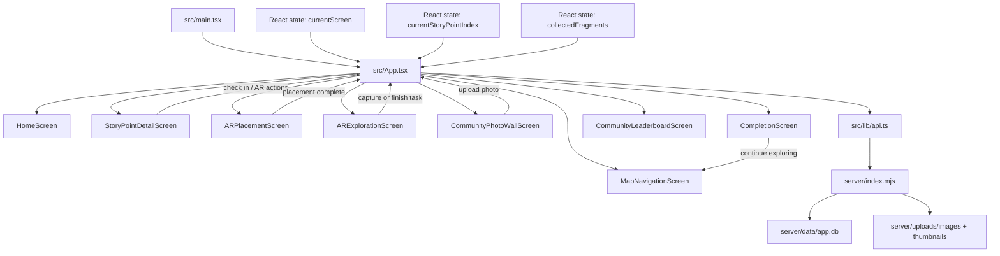

# System Architecture

## Current Architecture

The system is now split into a Vite-based React client and a lightweight Node backend. The client still controls screen flow and presentation, while the backend manages account sessions, persists journey progress in SQLite, stores processed uploads, and aggregates community data for the photo wall and leaderboard.

## Data Flow Summary

1. `src/main.tsx` mounts the application.
2. `src/App.tsx` acts as the screen controller and central state container.
3. Screen components under `src/components/` render the current journey stage and call handler functions passed from `App.tsx`.
4. Signed-in users authenticate through backend session endpoints.
5. User actions call backend APIs for checkpoint completion, community uploads, likes, and guide requests.
6. The backend stores relational data in `server/data/app.db`, migrates legacy JSON data when needed, writes processed images and thumbnails under `server/uploads`, and returns normalized responses.
7. The updated responses drive the completion screen, community wall flow, and leaderboard experience.

## Portfolio Alignment Notes

- The live system is a responsive web app that can be hosted on Vercel or GitHub Pages.
- The architecture supports the three showcased must-have playful features: story exploration, AR-style guide interaction, and community participation.
- The current implementation demonstrates both client interaction-state management and a practical backend persistence layer.

## Mermaid Diagram

```mermaid
flowchart TD
    A["src/main.tsx"] --> B["src/App.tsx"]
    B --> C["HomeScreen"]
    B --> D["MapNavigationScreen"]
    B --> E["StoryPointDetailScreen"]
    B --> F["ARPlacementScreen"]
    B --> G["ARExplorationScreen"]
    B --> H["CommunityPhotoWallScreen"]
    B --> I["CompletionScreen"]
    B --> J["CommunityLeaderboardScreen"]

    K["React state: currentScreen"] --> B
    L["React state: currentStoryPointIndex"] --> B
    M["React state: collectedFragments"] --> B

    E -->|check in / AR actions| B
    F -->|placement complete| B
    G -->|capture or finish task| B
    H -->|upload photo| B
    I -->|continue exploring| D
    B --> N["src/lib/api.ts"]
    N --> O["server/index.mjs"]
    O --> P["server/data/app.db"]
    O --> Q["server/uploads/images + thumbnails"]
```

## Current Backend Responsibilities

- create and validate user accounts plus expiring session tokens
- persist collected fragments and current story-point progress per user in SQLite
- compress uploaded images, generate thumbnails, and store photo metadata
- support like actions and aggregate leaderboard rankings
- proxy Zhang Ji guide requests so AI credentials are not exposed in the browser
- expose backend health counters for quick local diagnostics

## Suggested Next Steps

- replace local SQLite and file storage with managed cloud database plus object storage
- add moderation rules for community content
- add password reset and account management flows
- add background cleanup for orphaned uploads and long-expired sessions
